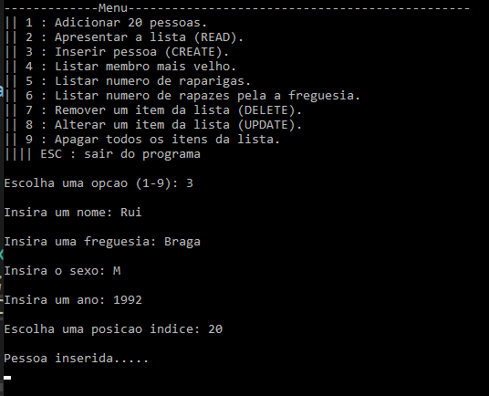
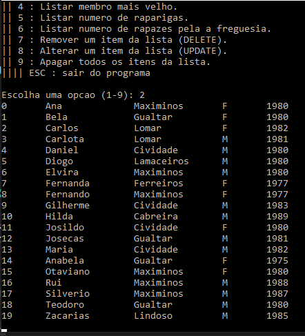
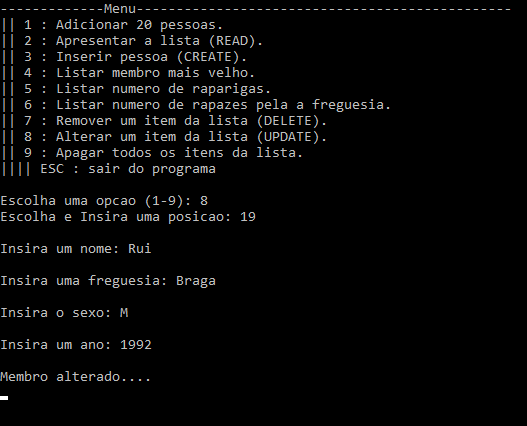
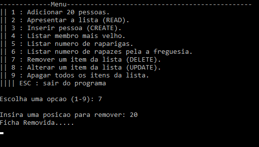
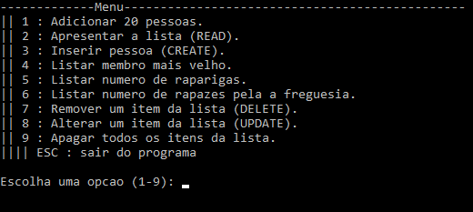

# C++ CRUD List Application

Um aplicativo simples baseado em console que permite aos usuários criar, ler, atualizar e excluir itens em uma lista.

---

## Features

### Adicionar novos itens à lista

### Ver todos os itens

### Atualizar itens existentes

### Remover itens por índice

### Interface de console orientada por menus


---

## Tech Stack

- C++
- Standard Library (iostream, vector, etc.)

---

## Concepts Practiced

- Funções
- Ciclos (while / for)
- Condicionais (if / switch)
- Structs e arrays
- Validação de input basico
- Programação modular

---

## How to Build & Run

### Usar CMake (recomendado)

```
git clone https://github.com/Excalibur202/Miniprojeto3.git
cd Miniprojeto3

mkdir build
cd build

cmake ..
cmake --build .

./ProjectName
```

### Usar g++

```
g++ Miniprojeto3_Rui.cpp -o main
./main
```

